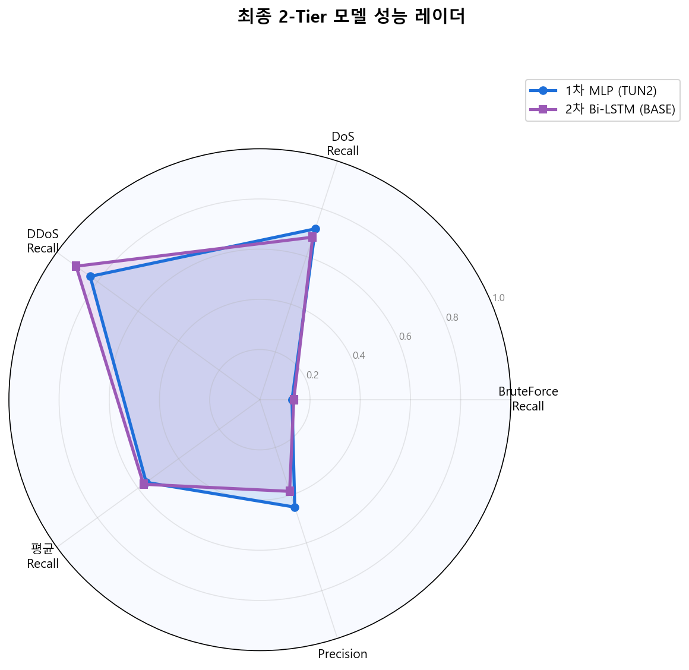

# DeepGuard — 딥러닝 기반 실시간 네트워크 침입 탐지 시스템


CICIDS2017 데이터셋을 기반으로 2-Tier Cascade 아키텍처를 구현한 비지도학습 NIDS다.
각 Tier에서 다수 모델을 벤치마크한 뒤 최고 성능 모델을 선정해 튜닝했다.

1차 방어선에서 MLP가 빠르게 의심 트래픽을 걸러 내고, 2차 방어선에서 Bi-LSTM이 정밀 심층 검사를 수행한다.
두 모델 모두 Autoencoder 기반 비지도학습으로 정상 패턴만 학습하기 때문에, 학습 데이터에 없는 Zero-Day Attack도 탐지 가능하다.

---

## 아키텍처


네트워크 트래픽
↓
**[1차 방어선 — Window=5, relu]**
MLP / CNN / GRU 벤치마크 → 최종 선정: MLP Autoencoder
(초고속 필터링 — 에폭당 5.66s)
↓ 의심 트래픽
**[2차 방어선 — Window=20, tanh]**
LSTM / Bi-LSTM 벤치마크 → 최종 선정: Bi-LSTM Autoencoder
(정밀 심층 검사 — 에폭당 120.77s)
↓
최종 판단

1차에 MLP를 배치한 핵심 이유는 속도다. MLP(5.66s)와 Bi-LSTM(120.77s)의 에폭당 속도 차이는 20배가 넘는다.
Bi-LSTM 단독으로 모든 트래픽을 처리하면 실시간 탐지가 불가능하다. MLP가 먼저 걸러 낸 의심 트래픽만 Bi-LSTM에 넘기는 구조가 2-Tier Cascade의 핵심이다.

---

## 기술 스택

- **AI/ML**: Python 3.10.6, TensorFlow/Keras, Scikit-learn
- **데이터**: Pandas, NumPy, CICIDS2017
- **대시보드**: Streamlit, Plotly
- **시각화**: Matplotlib, Scipy
- **개발 환경**: VS Code (Cursor), Kaggle Notebook
- **버전 관리**: Git, GitHub

---

## 데이터셋

CICIDS2017 (Canadian Institute for Cybersecurity)

| 파일 | 공격 유형 | 용도 |
|------|-----------|------|
| Monday | BENIGN 100% | 학습 |
| Tuesday | Brute Force (FTP-Patator) | 테스트 |
| Wednesday | DoS (slowloris) | 테스트 |
| Friday-Afternoon | DDoS | 테스트 |

- 전체 피처: 79개 → 전처리 후 78개
- 학습 데이터: 529,481개 중 50% 샘플링 → 약 238,000개
- 전처리: IP/Port 제거 → MinMaxScaler(정상 데이터로만 fit) → Sliding Window(3D 텐서 변환)


원본 CSV는 용량 문제로 이 저장소에 포함하지 않는다. CICIDS2017 공식 페이지에서 직접 받아 `data/CICIDS2017/`에 두면 된다.

---

## 벤치마크 결과

### 1차 방어선 (Window=5, relu)

| 모델 | BruteForce | DoS | DDoS | 평균 Recall | 에폭당 속도 |
|------|-----------|-----|------|------------|------------|
| **MLP** ✅ | 0.066 | 0.714 | 0.835 | **0.538** | **5.66s** |
| CNN | 0.055 | 0.712 | 0.835 | 0.534 | 9.32s |
| GRU | 0.059 | 0.696 | 0.790 | 0.515 | 21.02s |

MLP 선정 근거: Recall 차이 0.004로 유의미하지 않고, 속도는 CNN 대비 40% 빠르다.
1차 방어선의 목적은 초고속 필터링이므로 MLP가 최적이다.

### 2차 방어선 (Window=20, tanh)

| 모델 | BruteForce | DoS | DDoS | 평균 Recall | 에폭당 속도 | 임계값 |
|------|-----------|-----|------|------------|------------|--------|
| LSTM | 0.170 | 0.637 | 0.885 | 0.564 | 72.07s | 0.002361 |
| **Bi-LSTM** ✅ | 0.135 | **0.681** | **0.905** | **0.573** | 120.77s | 0.000907 |

2차 방어선에서 relu 대신 tanh를 적용했다. Window=20의 긴 시퀀스에서 기울기 폭발을 방지하고 학습 효율을 높이기 위해서다.
tanh 적용 후 LSTM 에폭당 속도가 114.86s → 72.07s로 38% 향상됐다.

---

## 최종 성능 (튜닝 후)



### 1차 MLP 튜닝 결과

| 모델 | BruteForce | DoS | DDoS | 평균 Recall |
|------|-----------|-----|------|------------|
| BASE (u64, p95) | 0.066 | 0.714 | 0.835 | 0.538 |
| TUN1 (u128, p95) | 0.064 | 0.707 | 0.824 | 0.531 ↓ |
| **TUN2 (u64, p90)** ✅ | **0.128** | **0.716** | **0.836** | **0.560** ↑ |
| TUN3 (u128, p90) | 0.117 | 0.650 | 0.686 | 0.484 ↓ |
| TUN4 (u64, p95, drop) | 0.069 | 0.706 | 0.801 | 0.525 ↓ |

임계값 완화(p95 → p90)가 BruteForce Recall을 2배 향상시킨 핵심이었다. units 증가와 Dropout은 효과가 없었다.

### 2차 Bi-LSTM 튜닝 결과

| 모델 | BruteForce | DoS | DDoS | 평균 Recall | 평균 Precision |
|------|-----------|-----|------|------------|---------------|
| **BASE (u64, p95)** ✅ | 0.135 | **0.681** | **0.905** | **0.573** | 0.384 |
| TUN_A (u64, p97) | 0.091 | 0.598 | 0.905 | 0.531 ↓ | 0.399 |
| TUN_B (u32, p95) | 0.142 | 0.392 | 0.890 | 0.475 ↓ | 0.389 |
| TUN_C (u32, p97) | 0.090 | 0.335 | 0.872 | 0.432 ↓ | 0.404 |

BASE가 최적이었다. p97 → Precision 소폭 상승 but Recall 급락. units=32 압축 시 DoS 0.681 → 0.392 폭락.

---

## Streamlit 시연 결과


| 공격 유형 | 데모 탐지율 | Kaggle 평가 결과 | 비고 |
|-----------|-----------|----------------|------|
| BruteForce | 0.0% | 0.128 | 비지도 학습 구조적 한계 |
| DoS | 64.8% | 0.716 | Kaggle 68%와 일치 |
| DDoS | 99.6% | 0.905 | Kaggle 90%와 유사 |

BruteForce 탐지율이 낮은 이유는 비지도 학습의 구조적 한계다.
초기 BruteForce 패킷은 정상 로그인 시도와 수학적으로 동일하게 생겼다.
IP/Port를 제거하고 순수 통계 피처만 보는 Autoencoder 입장에서는 버퍼에 비정상 반복 패턴이 쌓이기 전까지 탐지가 불가능하다.
이 결과를 근거로 Rule-based 시스템(Snort/Suricata)과의 하이브리드 아키텍처가 실무에서 필수적임을 확인했다.

---

## 준비

```bash
pip install -r requirements.txt
```

`data/CICIDS2017/`에 원본 CSV가 있는지 확인한다. 시연용 데이터(`data/demo_raw_3.csv`)는 저장소에 포함되어 있다.

---

## 실행

### Streamlit 대시보드

```bash
streamlit run dashboard/app.py
```

처음 실행 시 `models/` 폴더에 아래 파일이 있어야 한다.

- `TUN2_u64_p90_nodrop.keras` — 1차 MLP 최종 모델
- `TUN2_u64_p90_nodrop_threshold.npy` — 1차 임계값 (0.000150)
- `bilstm_tanh_base.keras` — 2차 Bi-LSTM 최종 모델
- `bilstm_tanh_base_threshold.npy` — 2차 임계값 (0.000907)
- `scaler.pkl` — MinMaxScaler

---

## 노트북 실행 순서

노트북은 Kaggle 환경 기준으로 작성되었다. 상단 환경 감지 코드가 로컬/Kaggle을 자동으로 구분해 경로를 설정한다.

| 순서 | 파일 | 내용 |
|------|------|------|
| 1 | `01_preprocessing.ipynb` | 전처리, MinMaxScaler fit, Sliding Window W5/W20 생성 |
| 2 | `02_tier1_mlp.ipynb` | MLP/CNN/GRU 벤치마크, MLP 튜닝 (TUN1~4) |
| 3 | `03_tier2_bilstm.ipynb` | LSTM/Bi-LSTM 벤치마크 (tanh), Bi-LSTM 튜닝 |
| 4 | `04_visualization.ipynb` | 시각화 10개 생성 (vis1~vis10) |

`preprocessed/` 폴더의 npy 파일은 용량 문제로 저장소에 포함하지 않는다.
`01_preprocessing.ipynb` 실행 결과로 생성된다.

---

## 프로젝트 구조

| 경로 | 역할 |
|------|------|
| `dashboard/app.py` | Streamlit 2-Tier 실시간 탐지 대시보드 |
| `data/demo_raw_3.csv` | 시연용 원본 트래픽 (6,000개, 연속 추출) |
| `models/` | 최종 모델 (.keras), 임계값 (.npy), 스케일러 (.pkl) |
| `notebooks/` | Kaggle 학습 노트북 (01~04) |
| `visualizations/` | 벤치마크·성능 시각화 결과물 (vis1~vis10) |
| `preprocessed/` | 슬라이딩 윈도우 적용 데이터 (.npy) — Git 미포함 |

---

## 라이선스·데이터 사용

CICIDS2017 데이터셋은 Canadian Institute for Cybersecurity가 제공한다.
다운로드·인용·재배포 규칙은 [데이터셋 페이지](https://www.unb.ca/cic/datasets/ids-2017.html)와 UNB 약관을 따른다.
이 저장소에는 원본 CSV를 포함하지 않는다.

코드는 학습·포트폴리오 참고용으로 올려 두었다.